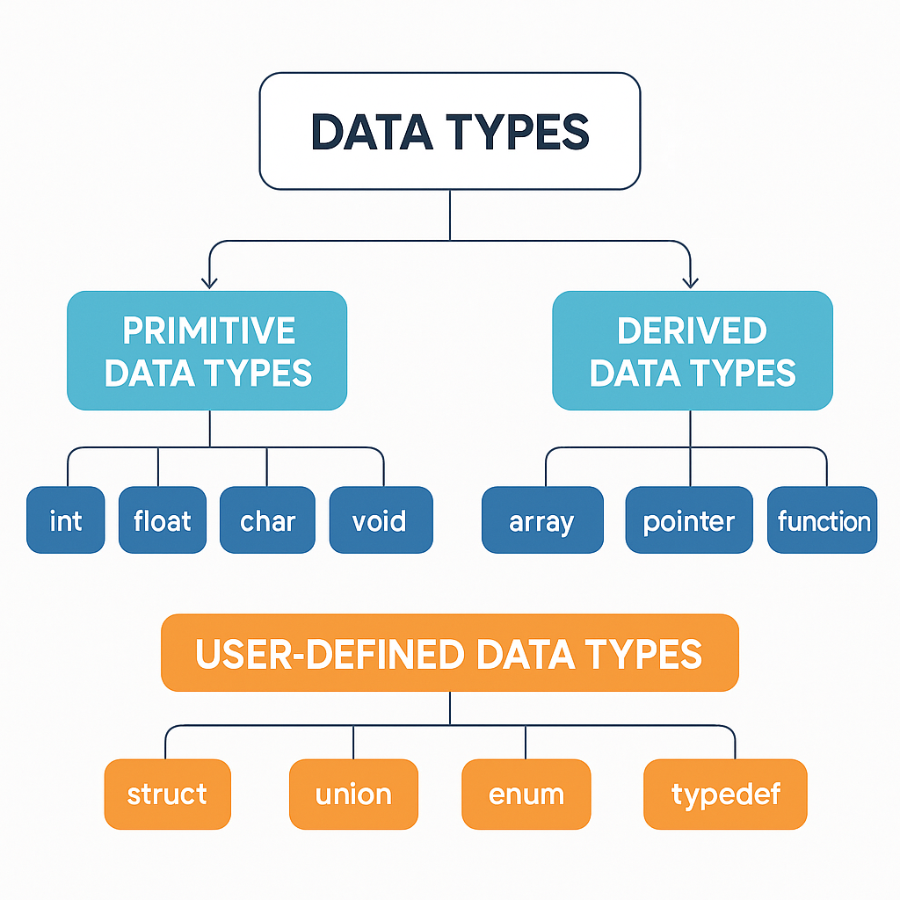

2’s Complement


## ① Finding 2’s Complement of any `int` in C
If you're dealing with a regular `int` (typically 32 bits on most systems):

```c
#include <stdio.h>

void print_binary(int n) {
    for (int i = 31; i >= 0; i--) {
        printf("%d", (n >> i) & 1);
    }
    printf("\n");
}

int main() {
    int num = 5;
    int two_complement = ~num + 1;

    printf("Original number: %d\n", num);
    printf("Binary of %d: ", num);
    print_binary(num);

    printf("Two's complement: %d\n", two_complement);
    printf("Binary of two's complement: ");
    print_binary(two_complement);

    return 0;
}
```

---
**Output:**
```
Original number: 5
Binary of 5: 00000000000000000000000000000101
Two's complement: -5
Binary of two's complement: 11111111111111111111111111111011
```

---
Notice:
- Positive `5` is normal binary.
- Negative `-5` is 2's complement binary form.

---
## ② How C Handles Overflow in 2's Complement

**Important rule**:
- In **unsigned types** (`unsigned int`, etc.) — **overflow is well-defined**: it wraps around (modulo arithmetic).
- In **signed types** (`int`, etc.) — **overflow is **undefined behavior** according to C standard**, but **in practice, on 2's complement machines**, it just wraps naturally.

### Example: Overflow with `unsigned`

```c
#include <stdio.h>

int main() {
    unsigned int x = 0xFFFFFFFF; // 2^32 - 1
    printf("x = %u\n", x);
    x += 1;
    printf("After adding 1, x = %u\n", x); // Wraps around to 0
    return 0;
}
```

**Output:**
```
x = 4294967295
After adding 1, x = 0
```

---
### Example: Overflow with `signed` (be careful!)

```c
#include <stdio.h>
#include <limits.h> // for INT_MAX

int main() {
    int x = INT_MAX;
    printf("x = %d\n", x);
    x += 1;
    printf("After adding 1, x = %d\n", x); // Undefined behavior, but usually wraps to INT_MIN
    return 0;
}
```

**On typical 2's complement systems**, `x` will become `-2147483648` (i.e., `INT_MIN`), but **officially it's undefined behavior**.

---
## ③ Quick Trick to Find 2's Complement (Interview Tip)

If you have a binary number and want its 2's complement **quickly by hand**:
1. Start from **rightmost bit**.
2. **Copy** all bits up to (and including) the first `1`.
3. **Flip** the remaining bits.

Example: find 2's complement of `00101100` (which is 44):

- Start from right: first `1` is at position 2.
- Copy rightward bits unchanged: `00`
- Flip the rest: `110100`
- Result: `11010100` (which is -44).

This trick saves time compared to manually flipping all bits and adding 1.

---

### ➔ Quick Summary

| Concept | Meaning |
|:---|:---|
| `~num` | Bitwise NOT: flips all bits. |
| `~num + 1` | Two's complement of `num`. |
| Overflow in unsigned | Wraps (modulo arithmetic). |
| Overflow in signed | Undefined, but wraps in practice on 2's complement machines. |


Pointers and References
Awesome — you’re doing great! 🔥  
Now let’s level up to **Pro-Level Pointers** in C:  

---

# 📍 Double Pointers (`int **p`)

---

## 1. What is a Double Pointer?

A **double pointer** is a pointer that points to another pointer.  
(aka "pointer to pointer")

✅ **Example:**
```c
int x = 10;
int *p = &x;
int **pp = &p;
```

- `pp` → points to `p`
- `p` → points to `x`
- So, `**pp` → accesses `x`

---

## 2. Visual

```
x = 10
p = &x
pp = &p

Memory layout:

| Address | Value   |
|---------|---------|
| 0x1000  | 10      | (x)
| 0x2000  | 0x1000  | (p)
| 0x3000  | 0x2000  | (pp)
```

✅ Access values:
- `x` = `10`
- `*p` = `10`
- `*pp` = address of x (0x1000)
- `**pp` = `10`

---

## 3. Why use double pointers?

- To **modify a pointer inside a function**.
- Dynamic **2D arrays**.
- Complex data structures like linked lists.

✅ **Example - changing a pointer inside a function:**
```c
void update(int **p) {
    static int y = 50;
    *p = &y;  // Change what p points to
}

int main() {
    int x = 10;
    int *p = &x;
    update(&p);
    printf("%d\n", *p);  // prints 50
}
```

---

# 📍 Pointer to Function

---

## 1. What is it?

A **pointer to a function** is a variable that holds the address of a function.

✅ **Example:**
```c
int add(int a, int b) {
    return a + b;
}

int (*fp)(int, int) = add;

printf("%d\n", fp(3,4));  // prints 7
```

- `fp` points to `add`.
- Call `fp(3,4)` like normal function.

---

## 2. Why pointer to function?

✅ For **callback functions**, **function tables**, **drivers**, **dynamic behavior**.

✅ Example in firmware:
```c
void (*initDevice)(void);
initDevice = initUART;  // or initSPI depending on config
initDevice();           // Call the right one at runtime
```

---

# 📍 Array of Pointers

---

## 1. What is an Array of Pointers?

✅ It's an array where each element is a pointer.

**Example:**
```c
char *arr[] = {"Hello", "World", "Pointers"};
```

- `arr[0]` → points to `"Hello"`
- `arr[1]` → points to `"World"`

✅ Access like:
```c
printf("%s\n", arr[1]);  // prints World
```

---

## 2. Why use array of pointers?

- For **dynamic strings**.
- **Efficient memory** if strings vary in size.
- Used heavily in **command-line arguments** (`char *argv[]`).

---

# 📌 Quick Visual: Function Pointer + Array

```c
int add(int a, int b) { return a+b; }
int sub(int a, int b) { return a-b; }

int (*ops[])(int,int) = {add, sub};

printf("%d\n", ops[0](2,3));  // 5
printf("%d\n", ops[1](5,1));  // 4
```
✅ Function pointer array — super useful in real projects!

---

# ✨ Final Quick Comparison

| Concept              | Example                   | Meaning                         |
|----------------------|----------------------------|---------------------------------|
| Pointer              | `int *p`                  | Points to int                   |
| Double Pointer       | `int **pp`                | Points to pointer to int         |
| Function Pointer     | `int (*fp)(int,int)`       | Points to a function             |
| Array of Pointers     | `char *arr[]`              | Array of pointers to strings    |

---

# 🧠 Real Interview Pointer Trick:

✅ If you pass a pointer to a function and want to **change the pointer itself**, you must pass a **double pointer**.

✅ If you just want to **change the value** the pointer points to, a **single pointer** is enough.


---

# 📚 Basic Level

1. **What is a pointer? Why are pointers used in C?**
   - A pointer is a variable that stores the address of another variable.
   - Pointers are used for dynamic memory allocation, efficient array handling, passing large data structures to functions without copying, and to implement data structures like linked lists and trees.

2. **How do you declare and initialize a pointer?**
   ```c
   int a = 10;
   int *p = &a;
   ```

3. **What is the output?**
   ```c
   int a = 5;
   int *p = &a;
   printf("%d\n", *p);
   ```
   **Answer:** `5` (Dereferencing `p` gives the value of `a`.)

4. **What happens when you dereference a NULL pointer?**
   - **Runtime crash** (Segmentation fault) — Undefined behavior.

5. **What is pointer arithmetic?**
   - Operations like increment (`p++`), decrement (`p--`), adding integers (`p + n`), and subtracting integers (`p - n`) on pointers.
   - It moves the pointer by multiples of the pointed data type's size.

6. **Difference between `*p++` and `(*p)++`?**
   - `*p++`: Increment pointer first, then dereference.
   - `(*p)++`: Dereference pointer first, then increment the value at the address.

---

# 🛠️ Intermediate Level

7. **Difference between:**
   - `int* p, a;` → `p` is pointer to int, `a` is int.
   - `int *p, *a;` → both `p` and `a` are pointers to int.

8. **What is a dangling pointer?**
   - A pointer that still points to a memory location that has been freed/deleted.

   ```c
   int *p = (int *)malloc(sizeof(int));
   free(p);
   // p is now dangling.
   ```

9. **What is a wild pointer?**
   - An uninitialized pointer (random address).

   ```c
   int *p; // Wild pointer
   ```

10. **Difference between `NULL` and `void*`?**
    - `NULL`: A macro representing 0 or an invalid pointer.
    - `void*`: A pointer type that can point to any data type.

11. **Assigning `void*` to `int*` without cast?**
    - In C (NOT C++), you **can** assign `void*` to any pointer type without explicit cast.

12. **Memory leak with pointers?**
    - Happens when dynamically allocated memory (`malloc`, etc.) is not freed, causing memory waste.

13. **What happens if you free a pointer twice?**
    - Undefined behavior, possible crash.

14. **Passing a pointer to a function?**
    ```c
    void func(int *p) {
        *p = 100;
    }
    ```

15. **Explain pointer to pointer (`int **ptr`).**
    - A pointer to another pointer that points to an int.

    Example:
    ```c
    int a = 5;
    int *p = &a;
    int **pp = &p;
    ```

---

# ⚡ Advanced Level

16. **Difference between arrays and pointers?**
    - Array: A fixed-size collection of elements.
    - Pointer: A variable that stores an address.

17. **Why can't you modify the array name (`arr++`) but can modify a pointer?**
    - Array name is a **constant pointer**; it represents a fixed address.
    - A pointer is a normal variable and can be changed.

18. **Output:**
    ```c
    int a[] = {10, 20, 30, 40};
    printf("%d\n", *(a + 2));
    ```
    **Answer:** `30`

19. **Function pointer example:**
    ```c
    int add(int a, int b) { return a + b; }
    int (*fptr)(int, int) = add;
    printf("%d\n", fptr(2, 3)); // Output: 5
    ```

20. **Pointer to array vs array of pointers:**
    - `int (*p)[5];` → pointer to array of 5 ints.
    - `int *p[5];` → array of 5 pointers to int.

21. **Dynamic 2D array using pointers:**
    ```c
    int **arr = malloc(rows * sizeof(int *));
    for (int i = 0; i < rows; i++) {
        arr[i] = malloc(cols * sizeof(int));
    }
    ```

22. **malloc vs calloc:**
    - `malloc`: Allocates memory, **does not initialize** it.
    - `calloc`: Allocates memory **and initializes** it to 0.

23. **Pointer arithmetic in `char*` vs `int*`?**
    - `char*` increments by 1 byte.
    - `int*` increments by 4 bytes (on 32-bit machine).

24. **`const` with pointers:**
    - `const int *p;` → pointer to constant int (can't change value).
    - `int *const p;` → constant pointer to int (can't change address).
    - `const int *const p;` → constant pointer to constant int.

25. **Can a function return a pointer?**
    - Yes, but be careful:
      - Returning a pointer to a local variable is wrong (lifetime issue).
      - Returning a pointer to malloc-ed memory is OK.

---

# 🧠 Tricky Pointer Problems

26. **After freeing and dereferencing pointer:**
    ```c
    free(p);
    printf("%d\n", *p);
    ```
    **Answer:** Undefined behavior (may crash).

27. **Output:**
    ```c
    int x = 10;
    int *ptr = &x;
    *ptr += 1;
    printf("%d\n", x);
    ```
    **Answer:** `11`

28. **Difference between:**
    ```c
    char *str = "Hello";
    char str[] = "Hello";
    ```
    - `char *str`: Pointer to a **string literal** (typically read-only).
    - `char str[]`: **Array** initialized with characters.

29. **Output:**
    ```c
    int arr[] = {1,2,3};
    int *p = arr;
    printf("%d", *(p++));
    printf("%d", *p);
    ```
    **Answer:** `12`
    - First `*(p++)` prints `1`, then pointer moves.
    - Then `*p` prints `2`.

30. **Pointer aliasing problem:**
    - If two pointers point to the same memory, changing one can affect the other. 
    - It can confuse compilers and optimizers (bad for performance).

---

# 🎯 Bonus Challenge: Swap without temp variable

```c
void swap(int *a, int *b) {
    *a = *a + *b;
    *b = *a - *b;
    *a = *a - *b;
}
```
**Note:** Safe for small integers. Be careful for overflow!

Great! Here's a **compact C Pointer Cheat Sheet** — perfect for last-minute review before your interview. ✅

---

# 📌 **C Pointer Cheat Sheet** (One-Page Summary)

---

### 🔹 **Declaration**

```c
int *p;         // p is a pointer to int
char *c;        // c is a pointer to char
int **pp;       // pp is a pointer to a pointer to int
```

> 💡 Only the variable next to `*` becomes a pointer.

---

### 🔹 **Initialization**

```c
int a = 5;
int *p = &a;    // p holds the address of a
```

---

### 🔹 **Dereferencing**

```c
*p = 10;        // sets value at address pointed by p
int x = *p;     // reads value at address
```

---

### 🔹 **Pointer Arithmetic**

```c
p++;            // moves pointer to next int (p + sizeof(int))
*p++;           // fetch then move
(*p)++;         // increment value at p
```

---

### 🔹 **Arrays vs Pointers**

```c
int arr[5];
int *p = arr;   // same as &arr[0]

arr[i] == *(arr + i) == *(p + i)
```

- `arr++` ❌ invalid (array name is constant)
- `p++` ✅ allowed

---

### 🔹 **Function and Pointers**

```c
void modify(int *p) {
    *p = 100;
}
```

```c
int x = 10;
modify(&x);    // x becomes 100
```

---

### 🔹 **Function Pointers**

```c
int add(int a, int b) { return a + b; }
int (*fp)(int, int) = add;
int res = fp(2, 3);  // res = 5
```

---

### 🔹 **Pointer to Array vs Array of Pointers**

```c
int (*p)[5];     // pointer to array of 5 ints
int *p[5];       // array of 5 int pointers
```

---

### 🔹 **Pointer to Pointer**

```c
int a = 5;
int *p = &a;
int **pp = &p;
```

---

### 🔹 **Dynamic Memory (Heap)**

```c
int *p = malloc(sizeof(int));  // allocates 4 bytes
*p = 10;
free(p);                       // deallocates memory
```

- `calloc(n, size)` → zero-initialized
- `realloc(p, new_size)` → resize

---

### 🔹 **Const with Pointers**

```c
const int *p;   // can't change value (*p), can change address (p = ...)
int *const p;   // can change value (*p), can't change address
const int *const p; // can't change either
```

---

### 🔹 **NULL & Dangling Pointers**

```c
int *p = NULL;   // safe initialization
free(p);         // must not be used after this
```

---

### 🔹 **Common Mistakes**

| Mistake | Problem |
|--------|---------|
| `int *p, q;` | Only `p` is a pointer |
| `p = &arr;` | Wrong type (`int (*)[n]` vs `int*`) |
| `*p = 10;` | Crashes if p is NULL or wild |

---

📍 **Final Tip:**  
Use tools like `valgrind`, `-Wall`, and `gdb` during practice to catch pointer bugs early.

---

Would you like this as a downloadable PDF for easy reference, or want a printable version too?


Files and Streams
In C, the **File System** and **Streams** are crucial concepts for managing data input and output (I/O). Understanding how to work with files and streams is essential for interacting with data stored on disk. Let's break them down.

### 1. **File System in C**
The **File System** refers to how files are stored and organized on storage devices (like hard drives, SSDs, etc.). In C, interacting with the file system involves using standard library functions to open, read, write, and close files.

C provides a set of functions for dealing with files through the standard I/O library (`stdio.h`).

#### File Operations in C

1. **Opening a file**:
   - To interact with a file, you must first open it using the `fopen()` function.
   - Syntax:
     ```c
     FILE *fopen(const char *filename, const char *mode);
     ```
     - `filename`: The name of the file you want to open.
     - `mode`: The mode in which to open the file (e.g., read, write).

   Common modes:
   - `"r"`: Read. Opens a file for reading. The file must exist.
   - `"w"`: Write. Opens a file for writing (creates a new file or truncates an existing file).
   - `"a"`: Append. Opens a file for appending (creates a new file or appends to an existing one).
   - `"rb"`, `"wb"`, etc.: Binary read/write modes.
   - `"r+"`: Read/Write. Opens a file for both reading and writing.

   Example:
   ```c
   FILE *file = fopen("example.txt", "r");
   if (file == NULL) {
       printf("Error opening file.\n");
   }
   ```

2. **Reading from a file**:
   - Use functions like `fgetc()`, `fgets()`, or `fread()` to read data from a file.

   Example (read character by character):
   ```c
   char c;
   while ((c = fgetc(file)) != EOF) {
       putchar(c);  // Print each character to stdout
   }
   ```

   Example (read line by line):
   ```c
   char buffer[100];
   while (fgets(buffer, sizeof(buffer), file)) {
       printf("%s", buffer);
   }
   ```

3. **Writing to a file**:
   - Use functions like `fputc()`, `fputs()`, or `fwrite()` to write data to a file.

   Example (write a character):
   ```c
   fputc('A', file);
   ```

   Example (write a string):
   ```c
   fputs("Hello, World!", file);
   ```

4. **Closing a file**:
   - Once you're done working with a file, always close it using `fclose()` to free system resources.
   ```c
   fclose(file);
   ```

### 2. **Streams in C**
A **stream** in C refers to a sequence of characters or bytes that can be read from or written to. Streams provide an abstraction for I/O operations, allowing you to interact with data in a consistent manner regardless of the underlying device (file, keyboard, network, etc.).

There are two main types of streams:
- **Input streams**: Used for reading data (e.g., `stdin`).
- **Output streams**: Used for writing data (e.g., `stdout`).

#### Standard Streams in C

1. **Standard Input (`stdin`)**:
   - A pre-defined stream that refers to the input source, typically the keyboard.
   - Functions like `scanf()` or `fgetc()` use `stdin` to read user input.

   Example:
   ```c
   char name[50];
   printf("Enter your name: ");
   fgets(name, sizeof(name), stdin);  // Read input from the keyboard
   ```

2. **Standard Output (`stdout`)**:
   - A pre-defined stream that refers to the output destination, typically the terminal.
   - Functions like `printf()` or `fputs()` use `stdout` to write output.

   Example:
   ```c
   printf("Hello, World!\n");
   ```

3. **Standard Error (`stderr`)**:
   - A pre-defined stream used for outputting error messages.
   - Unlike `stdout`, it is not buffered, so it’s immediately shown on the screen.

   Example:
   ```c
   fprintf(stderr, "An error occurred.\n");
   ```

#### Stream Functions

- **`fgetc()`**: Reads a single character from a file.
- **`fgets()`**: Reads a line of text from a file.
- **`fputc()`**: Writes a single character to a file.
- **`fputs()`**: Writes a string to a file.
- **`fread()`**: Reads a block of data from a file.
- **`fwrite()`**: Writes a block of data to a file.

#### Buffering

- Streams in C are often **buffered**. This means that data is temporarily stored in a buffer (a memory area) before being read from or written to a file. This helps improve performance because I/O operations can be slow.
- For example, when using `printf()`, data is buffered and written to the terminal in chunks.
- You can control buffering using `setvbuf()` and `fflush()` functions.

### Example: File I/O with Streams

Here is an example that demonstrates how to open a file, write to it, and then read from it:

```c
#include <stdio.h>

int main() {
    FILE *file = fopen("example.txt", "w+");  // Open for read and write
    if (file == NULL) {
        printf("Error opening file.\n");
        return 1;
    }

    // Writing to file
    fputs("Hello, File System!", file);

    // Move the file pointer to the beginning
    fseek(file, 0, SEEK_SET);

    // Reading from file
    char buffer[100];
    if (fgets(buffer, sizeof(buffer), file)) {
        printf("File content: %s\n", buffer);
    }

    // Close the file
    fclose(file);
    return 0;
}
```

### Summary

- **File System** in C: Involves functions like `fopen()`, `fclose()`, `fread()`, and `fwrite()` to interact with files.
- **Streams**: Abstractions for reading and writing data. You use streams like `stdin`, `stdout`, and `stderr` for input and output operations.
- **Buffering**: Data is buffered for better performance during I/O operations, and functions like `setvbuf()` and `fflush()` control buffering.

By mastering these concepts, you'll be able to work effectively with files and data streams in C.


Absolutely!  
Let’s go through **each of the questions** with **clear, interview-style answers**.  
(You can even practice memorizing in a Q&A flashcard style.)

---

## 📚 Basic Questions and Answers

**1. What are the different modes to open a file in C?**
- `"r"` → Open for reading. File must exist.
- `"w"` → Open for writing. Creates file or **truncates** existing one.
- `"a"` → Open for appending. Creates file if it doesn't exist.
- `"r+"` → Open for reading and writing. File must exist.
- `"w+"` → Open for reading and writing. Creates file or truncates.
- `"a+"` → Open for reading and appending. Creates file if needed.

---

**2. Difference between `"r+"` and `"w+"`?**
- `"r+"`: Opens an **existing** file for read/write. Fails if file doesn't exist.
- `"w+"`: Creates a new file (or **clears** if already exists) for read/write.

---

**3. What happens if you open a file with `"r"` mode but it doesn’t exist?**
- `fopen` returns `NULL`, and `errno` is set.

---

**4. What does `fopen()` return?**
- A `FILE *` pointer on success.
- `NULL` on failure.

---

**5. What is `EOF`?**
- `EOF` is a constant (-1) meaning **End Of File** or error during file operations.

---

**6. Difference between `fputs()` and `fprintf()`?**
- `fputs()` just writes a string.
- `fprintf()` is formatted output (like `printf` into a file).

---

**7. Difference between `fgets()` and `fscanf()`?**
- `fgets()` reads a line into a buffer (including spaces).
- `fscanf()` reads formatted input (may stop at spaces).

---

## 📄 File pointer and operations

**8. What is a `FILE *`?**
- It's a pointer to an internal C structure that holds file metadata, buffer info, file descriptor, etc.

---

**9. What does `fflush()` do?**
- Forces the internal buffer to be physically written to disk for output streams.
- **Undefined** behavior if used on input streams (`stdin`) in C standard (but sometimes supported).

---

**10. Explain `fseek()`, `ftell()`, and `rewind()`.**
- `fseek(FILE *, long offset, int whence)` moves the file position.
- `ftell(FILE *)` returns current file pointer position (in bytes).
- `rewind(FILE *)` is shorthand for `fseek(file, 0, SEEK_SET)`.

---

**11. What happens if you call `fseek()` with invalid parameters?**
- `fseek()` returns a non-zero value (usually -1) and sets error.

---

**12. How to move the file pointer to the end of a file?**
```c
fseek(file, 0, SEEK_END);
```

---

**13. Why should you call `fclose()`?**
- To flush all buffers, release file descriptors, and avoid memory leaks.

---

## 🔥 Trickier / Advanced

**14. In `"a+"` mode, if you `fseek` somewhere and write, where will write happen?**
- It **always** writes at the end, ignoring the `fseek` position.

---

**15. Can you read and write simultaneously on a `FILE *`?**
- Yes, but you **must call** `fflush()`, `fseek()`, or `rewind()` **between** reading and writing.

---

**16. What happens if you `fputs` and then `fgets` without flushing?**
- You may get undefined behavior, wrong data, or stale buffer content.

---

**17. What are buffered and unbuffered streams?**
- Buffered: Data is stored temporarily in memory (like stdout by default).
- Unbuffered: Each I/O operation directly hits the file/device (e.g., stderr often unbuffered).

---

**18. Why is `fread()`/`fwrite()` faster than `fgetc()`/`fputc()`?**
- `fread`/`fwrite` move **blocks** of data at once; `fgetc`/`fputc` work **one character** at a time.

---

**19. How to detect binary vs text file?**
- No strict way in standard C. By convention, text files have readable ASCII; binary may contain non-printable characters.

---

**20. How to copy one file into another?**
```c
#include <stdio.h>

int main() {
    FILE *src = fopen("source.txt", "r");
    FILE *dest = fopen("dest.txt", "w");
    char buffer[1024];
    
    if (!src || !dest) {
        perror("Error opening files");
        return 1;
    }

    size_t n;
    while ((n = fread(buffer, 1, sizeof(buffer), src)) > 0) {
        fwrite(buffer, 1, n, dest);
    }

    fclose(src);
    fclose(dest);
    return 0;
}
```

---

# ⚡ Bonus Tip:
Many interviewers care less about syntax and **more about knowing edge-cases** (like flushing between read/write, how "a+" forces writes to end, what happens if `fseek` fails).

---

Would you also like me to create a **mini cheat-sheet page** you could use for final quick revision right before your interview? 🚀  
(It would be just 1–2 pages: very tight and dense.)


Awesome — here's a **tight mini cheat-sheet** for C **File and Streams** — perfect for a final review before an interview!  
I'll make it dense but super clear.

---

# 📄 C FILE and STREAMS — MINI CHEAT SHEET

---

## 📚 FILE OPEN MODES

| Mode  | Meaning                         |
|:-----:|:---------------------------------|
| `"r"` | Read, must exist                 |
| `"w"` | Write, create or truncate        |
| `"a"` | Append, create if missing        |
| `"r+"`| Read and write, must exist        |
| `"w+"`| Write and read, truncate/create  |
| `"a+"`| Append and read, create if needed |

✅ `fopen()` returns `FILE *` or `NULL`.

---

## 📂 COMMON FUNCTIONS

| Function | Purpose |
|:---------|:--------|
| `fopen(filename, mode)` | Open file |
| `fclose(file)`          | Close file |
| `fflush(file)`          | Flush output buffer |
| `fseek(file, offset, origin)` | Move file pointer |
| `ftell(file)`           | Get current file pointer |
| `rewind(file)`          | Go to start of file |
| `fgets(buffer, size, file)` | Read string from file |
| `fputs(string, file)`   | Write string to file |
| `fread(ptr, size, nitems, file)` | Block read |
| `fwrite(ptr, size, nitems, file)`| Block write |

---

## 🎯 KEY RULES

- Always `fclose(file)` to avoid leaks.
- `"a"` and `"a+"` **always write at end**, even after `fseek`.
- To switch read ↔ write: `fflush(file)` or `fseek(file, 0, SEEK_CUR)`.
- `fflush(stdin)` is **undefined behavior**.
- `EOF` = `-1` indicates end of file or error.

---

## 📏 POSITIONING

| Seek From | Constant     |
|:---------:|:------------:|
| Start     | `SEEK_SET`   |
| Current   | `SEEK_CUR`   |
| End       | `SEEK_END`   |

```c
fseek(file, 0, SEEK_END);  // Move to end
rewind(file);              // Shortcut to SEEK_SET
```

---

## ⚡ MINI CODE SNIPPETS

**Open file for append:**
```c
FILE *file = fopen("data.txt", "a+");
```

**Write and rewind:**
```c
fputs("Hello\n", file);
fflush(file);
rewind(file);
```

**Read and print:**
```c
char buf[100];
while (fgets(buf, sizeof(buf), file)) {
    printf("%s", buf);
}
```

**Copy file:**
```c
char buf[1024];
size_t n;
while ((n = fread(buf, 1, sizeof(buf), src)) > 0)
    fwrite(buf, 1, n, dest);
```

---

## 🧠 COMMON INTERVIEW TRAPS

- `"rw"` **is invalid**; must use `"r+"`.
- Forgetting `fflush()` or `fseek()` between read and write.
- Assuming `fread` reads full blocks — **it may not** (check returned size!).
- `fseek` after writing in `"a+"` mode doesn't move write position — writes still go at **end**.

---

# 🌟 Rapid Flash Reminders:
- `fseek + fwrite = Manual control`
- `"a+" mode = Always end"`
- `fflush = Commit to file`
- `fread/fwrite = Bulk speed`
- `fgets = reads spaces`
- `fscanf = formatted read`

---

---
Would you also like me to give you a **few last-minute practice interview questions** that would fit on the back of this cheat-sheet, just in case you want a *super compact* mock test too? 🚀  
(They’d be very "interview-realistic.")


Perfect!  
Here’s a set of **last-minute compact practice questions** you could keep on the back of the cheat-sheet — super realistic and designed for C interviews (especially firmware, embedded, or systems-level roles):


---

# 🎯 C FILE AND STREAMS — QUICK PRACTICE QUESTIONS

---

## 📚 Basics
1. **List three valid `fopen` modes to both read and write a file.**
2. **What does `fopen` return if it fails?**
3. **What are the arguments of `fseek()`?**

---

## 📂 File operations
4. **How would you move the file pointer to the start of a file?**
5. **What happens if you open a file with `"w"`?**
6. **What's the purpose of `fflush(file)` after `fputs()`?**

---

## 🧠 Concepts
7. **In `"a+"` mode, where does writing happen after a `fseek()`?**
8. **Can you immediately switch from writing to reading without calling any function? Why or why not?**
9. **What is the difference between `fgets()` and `fscanf()`?**

---

## 🔥 Advanced
10. **Write 3 lines of code to append "Hello World" to the end of `output.txt`.**
11. **How can you check if you have reached the end of a file while reading?**
12. **What happens if you forget to call `fclose(file)`?**

---

# ⚡ Ultra-Speed Bonus (if you have 10 seconds):
- What's the default buffering behavior for `stdout`?
  > (Answer: Line-buffered if terminal, fully-buffered if file.)

---

# ✍️ Tiny Sample Answer Key
(You can fold this into very tiny notes.)

| Q# | Short Answer |
|:--:|:------------:|
| 1 | `"r+"`, `"w+"`, `"a+"` |
| 2 | `NULL` |
| 3 | `FILE *, long offset, int whence` |
| 4 | `rewind(file)` |
| 5 | File is created or truncated |
| 6 | Force buffer flush to disk |
| 7 | Always at end |
| 8 | No, must `fflush`/`fseek` first |
| 9 | `fgets` reads line with spaces, `fscanf` parses formats |
| 10 | ```FILE *f=fopen("output.txt","a+");fputs("Hello World\n",f);fclose(f);``` |
| 11 | Check if `fgets` or `fread` returns `NULL`, or use `feof(file)` |
| 12 | Memory leak, data loss if not flushed |

---

✅ If you even casually glance over these for 10–15 minutes, you’ll be super sharp for C file/stream questions!

---

**Would you also like a "challenge level" final problem** (something like: "Reverse the lines of a file" or "Count all words in a file") that many companies use to *separate average candidates from really good ones*? 🚀  
(Only if you want!)


Preprocessor directives

What goes inside the compilation process?
A compiler converts a C program into an executable. There are four phases for a C program to become an executable: 
Pre-processing
Compilation
Assembly
Linking
By executing the below command while compiling the code, we get all intermediate files in the current directory along with the executable.
gcc -Wall -save-temps filename.c –o filename


The following screenshot shows all generated intermediate files.

Let us one by one see what these intermediate files contain.
1. Pre-processing
This is the first phase through which source code is passed. This phase includes:
Removal of Comments
Expansion of Macros
Expansion of the included files.
Conditional compilation
The pre-processed output is stored in the filename.i. Let’s see what’s inside filename.i: using $vi filename.i 
In the above output, the source file is filled with lots and lots of info, but in the end, our code is preserved. 
printf contains now a + b rather than add(a, b) that’s because macros have expanded.
Comments are stripped off.
#include<stdio.h> is missing instead we see lots of code. So header files have been expanded and included in our source file.
2. Compiling
The next step is to compile filename.i and produce an; intermediate compiled output file filename.s. This file is in assembly-level instructions. Let’s see through this file using $nano filename.s  terminal command.

Assembly Code File
The snapshot shows that it is in assembly language, which the assembler can understand.
3. Assembling
In this phase the filename.s is taken as input and turned into filename.o by the assembler. This file contains machine-level instructions. At this phase, only existing code is converted into machine language, and the function calls like printf() are not resolved. Let’s view this file using $vi filename.o 

Binary Code
4. Linking
This is the final phase in which all the linking of function calls with their definitions is done. Linker knows where all these functions are implemented. Linker does some extra work also: it adds some extra code to our program which is required when the program starts and ends. For example, there is a code that is required for setting up the environment like passing command line arguments. This task can be easily verified by using size filename.o and size filename. Through these commands, we know how the output file increases from an object file to an executable file. This is because of the extra code that Linker adds to our program.
Linking can be of two types:
Static Linking: All the code is copied to the single file and then executable file is created.
Dynamic Linking: Only the names of the shared libraries is added to the code and then it is referred during the execution.
GCC by default does dynamic linking, so printf() is dynamically linked in above program.


Directive
What It Does
Example
#include
Adds another file into your code
#include <stdio.h>
#define
Defines constants or macros (shortcuts)
#define PI 3.14
#undef
Undefines a macro
#undef PI
#ifdef / #ifndef
Checks if a macro is (or isn't) defined
#ifdef DEBUG
#if, #else, #elif, #endif
Conditional compilation
#if VERSION == 2
#pragma
Special instructions to compiler (compiler-specific)
#pragma once

Awesome! Here's a **one-page quick summary** on **C Preprocessor Directives** for fast revision:

---

# 📋 C Preprocessor Directives — Quick Revision Sheet

---

## 1. **Basics**
- **Preprocessor directives** start with `#`.
- Processed *before* compilation.
  
**Common directives**:
- `#define`: Define macros
- `#undef`: Undefine macros
- `#include`: Include files
- `#ifdef`, `#ifndef`, `#if`, `#elif`, `#else`, `#endif`: Conditional compilation
- `#pragma`: Special compiler instructions

---

## 2. **Macros**
- **Object-like macro**:  
  ```c
  #define PI 3.1415
  ```

- **Function-like macro**:  
  ```c
  #define SQUARE(x) ((x)*(x))
  ```

- **Multiple arguments**:  
  ```c
  #define MAX(a,b) ((a)>(b)?(a):(b))
  ```

- Always use **parentheses** around macro arguments and entire expression!

---

## 3. **Conditional Compilation**
- **Example**:
  ```c
  #ifdef DEBUG
    printf("Debug mode\n");
  #endif
  ```

- **Include guards** (to avoid multiple inclusion):
  ```c
  #ifndef HEADER_H
  #define HEADER_H
  // content
  #endif
  ```

- **Platform-specific compilation**:
  ```c
  #ifdef _WIN32
    // Windows code
  #else
    // Unix/Linux code
  #endif
  ```

---

## 4. **Advanced Macro Tricks**
- **Token Pasting (`##`)**:
  ```c
  #define MAKE_VAR(x) my_##x
  // MAKE_VAR(name) → my_name
  ```

- **Stringification (`#`)**:
  ```c
  #define TO_STRING(x) #x
  // TO_STRING(Hello) → "Hello"
  ```

- **Variadic Macros**:
  ```c
  #define LOG(fmt, ...) printf(fmt, __VA_ARGS__)
  ```

---

## 5. **#pragma**
- Compiler-specific instructions.
- Example:  
  ```c
  #pragma once
  ```
  (alternative to include guards)


## 6. **Common Pitfalls**
- **Side effects**:  
  `SQUARE(x++)` expands badly → prefer `inline` functions in C99+.
- **No type checking**: Macros don't respect types like functions do.
- **Debugging macros**: Harder to trace errors.

---

# ✅ Quick Tips:
- Always wrap macro arguments and expressions in parentheses.
- Use include guards or `#pragma once`.
- Prefer `const` or `inline` over macros when possible for safety.
- Be careful with macro expansions in complex expressions.


Questions 👍
Q:What is the purpose of the C preprocessor, and when does it run during the build process?

The preprocessor runs before the compiler. It processes directives like #include, #define, #ifdef, and #pragma. It handles file inclusion, macro expansion, and conditional compilation. It does not compile code — it just prepares the source code for the compiler."

"#include <file> searches for the file in the system directories, typically used for standard library headers.
#include "file" first searches in the current directory (where the source file is located), and if the file isn’t found, it then searches the system directories."

Q : difference between const and #define
"#define is a preprocessor directive that replaces text in the code before compilation. It doesn't have type checking and is typically used for constants or macros. Unlike const, which is type-safe and evaluated at runtime, #define performs simple text substitution without considering types."

"Include guards are used to prevent multiple inclusions of a header file in the same file. The typical pattern involves #ifndef (if not defined), followed by #define to mark it as included. If the file is included again, the #ifndef condition will fail, and the content of the file will be skipped until the end of the inclusion block marked by #endif."

"Macros in C are powerful but can be tricky to debug because they are replaced by the preprocessor before compilation, making it difficult to trace the replaced code during debugging. Additionally, macros lack type safety and can lead to unexpected behavior, especially when evaluating expressions multiple times. Inline functions provide a safer alternative as they offer type checking, no repeated evaluation, and are easier to debug because they are actual functions, not just text replacements."

"#ifdef checks if a macro is defined. It's typically used for conditional compilation based on whether a macro has been set earlier, like #ifdef WINDOWS.
#if checks whether an expression or constant is true, not just if a macro is defined. For example, #if VERSION == 2would check the value of the VERSION macro."

"#pragma once is a directive that prevents a header file from being included multiple times in the same compilation. It's more concise and generally faster than traditional include guards, which use #ifndef, #define, and #endif to do the same job. While most modern compilers support #pragma once, it's not part of the C standard, so it’s not guaranteed to work on all compilers."

"#undef removes a macro definition. It allows you to undefine a macro that was previously defined with #define, so it no longer exists for the rest of the code. This is useful if you want to redefine a macro in different parts of the code or when a macro is only valid for a specific section of your code."

"Variadic macros allow you to define macros that accept a variable number of arguments, which is not possible with regular macros. They are similar to varargs in other languages. To use them, the macro defines a placeholder ... for the arguments, and inside the macro body, __VA_ARGS__ is used to represent those arguments. For example:
c
CopyEdit
#define LOG(fmt, ...) printf(fmt, __VA_ARGS__)


🔹 Key Takeaways:
#line modifies the line number and filename for the purpose of debugging.
It’s often used in generated code or tools that modify source code during the build process.

# Endanity and Such


### 🧠 **Endianness Explained**

**Endianness** defines the byte order used to store multi-byte data types (like `int`, `float`, etc.) in memory.

---

### ✅ Big-endian

* **Definition**: Most Significant Byte (MSB) stored at **lowest memory address**.
* Example:
  For value `0x12345678`, memory layout:

  ```
  Address →    [0]   [1]   [2]   [3]  
  Data    →   0x12  0x34  0x56  0x78
  ```

---

### ✅ Little-endian (Most modern CPUs, including Intel, ARM in iPhones)

* **Definition**: Least Significant Byte (LSB) stored at **lowest memory address**.
* Example:
  For value `0x12345678`, memory layout:

  ```
  Address →    [0]   [1]   [2]   [3]  
  Data    →   0x78  0x56  0x34  0x12
  ```

---

### 🔍 Detecting Endianness in C

```c
#include <stdio.h>
int main() {
    unsigned int x = 0x12345690;
    unsigned char *c = (unsigned char*)&x;

    printf("Sizeof: %lu\n", sizeof(x));
    printf("C Value: 0x%X\n", *c); // Least significant byte

    if (*c == 0x90) {
        printf("Little-endian\n");
    } else {
        printf("Big-endian\n");
    }
    return 0;
}
```

* Explanation:

  * We check the first byte pointed by `unsigned char *c`.
  * If it shows `0x90`, the system is **Little-endian**.
  * This works because the least significant byte comes first in memory.

---

### 🔁 Swapping Endian (32-bit Example)

```c
#include <stdio.h>
unsigned int swap_endian32(unsigned int x) {
    return ((x >> 24) & 0x000000FF) | 
           ((x >> 8)  & 0x0000FF00) | 
           ((x << 8)  & 0x00FF0000) | 
           ((x << 24) & 0xFF000000);
}
int main() {
    unsigned int num = 0x12345678;
    unsigned int swapped = swap_endian32(num);
    printf("Original: 0x%X\n", num);
    printf("Swapped : 0x%X\n", swapped);
    return 0;
}
```

---

### 💬 Interview Questions on Endianness

1. **What is endianness?**
   → It determines the byte order in memory for multi-byte data.

2. **How to check endianness at runtime?**
   → Use pointer casting and check the first byte, as shown in code.

3. **Why is endianness important?**
   → Critical for:

   * Data transmission across systems
   * Reading/writing binary files
   * Embedded communication protocols

4. **What is network byte order?**
   → **Big-endian**
   Use `htons()`, `htonl()` to convert from host to network order.

5. **How to manually swap bytes of a number?**
   → Write bitwise shift-based functions (like `swap_endian32()`).

6. **What goes wrong if endianness isn’t handled?**
   → Misinterpreted data, corrupted values, hard-to-find bugs.

7. **Is endianness a compiler or hardware feature?**
   → **Hardware** feature defined by CPU architecture.

8. **Can a CPU support both endian modes?**
   → Some (e.g., ARM) are bi-endian but typically fixed at runtime.

9. **Does endianness affect structs and bit-fields?**
   → Yes. Structs with mixed field sizes or bit-fields are impacted.

10. **Trap question — Is `char` affected by endianness?**
    → **No**. `char` is 1 byte. Endianness matters only for data types > 1 byte.

---

### 🧨 Pro Tips

* Always convert to **network byte order** before sending structured data over the wire.
* **Never use bitfields** in communication protocols unless architecture is fixed.
* When working with files or network, **document and enforce endianness**.

1. What is endianess? Explain big-endian and little-endian.
Basic theory question. Interviewer wants you to explain how multi-byte data is stored differently.

2. How can you check endianness of a machine at runtime in C?
Write a small C program (like the one we discussed earlier — using pointer and dereferencing first byte).

3. Why do we care about endianess?
Key points:
Communication between different systems (networking, file I/O, embedded protocols)


Data stored on disk


Consistency when sending/receiving structured data


4. What is network byte order?
Answer:
Network byte order is big-endian.
When you send data over network (TCP/IP), you must convert host data to network byte order using htons(), htonl(), etc.

5. How would you swap bytes of a 16-bit/32-bit/64-bit number manually?
Practical: Write a byte swapping function without using library functions.
Example you should be able to write:
unsigned int swap32(unsigned int x) {
    return ((x >> 24) & 0x000000FF) |
           ((x >> 8)  & 0x0000FF00) |
           ((x << 8)  & 0x00FF0000) |
           ((x << 24) & 0xFF000000);
}

6. What problems can occur if endianess is not handled properly between systems?
Important:
Wrong interpretation of values (e.g., 0x12345678 vs 0x78563412)


Corrupted data


Bugs that are hard to detect without checking raw memory


7. Is endianess a compiler feature or a hardware feature?
Correct answer:
Hardware feature.
The CPU architecture (Intel, ARM, etc.) defines the endianness.
(Compilers must follow the CPU’s behavior.)

8. Can a CPU support both endian modes?
Some CPUs like ARM are bi-endian — they can switch between little-endian and big-endian with special instructions.
(But in most cases, it’s fixed — for example, iPhones are always little-endian.)

9. How does endianess affect struct packing and memory layout?
More advanced question:
The order of bytes inside a struct can be affected by endianess when you serialize or send raw memory over the network.
You have to be careful with structs that mix different field sizes (like char, int, short) — alignment and padding rules still apply!

10. Endianess in Bitfields — what is the trap?
Really nasty interview question:
Bitfield layout (if you use struct { unsigned int a:3; unsigned int b:5; }) depends on compiler, CPU, and endianess.

Never use bitfields for network protocols unless you control all hardware and compilers.

Bonus “Trap” Questions:
What endianess is used when writing into a file using fwrite()?

 Whatever the machine uses unless you manually convert it.


Is char affected by endianess?

 No — char is always 1 byte, endianess matters only for types bigger than 1 byte (short, int, float, etc.)


🔥 Tip:
If you can explain when endianess matters and how to detect and handle it safely, you’re already ahead of many candidates!


Memory
2. 
Memory Layout of a Program
This is about how a C program’s memory is organized:
Text segment: Code (functions)


Data segment: Global/static variables (initialized)


BSS segment: Global/static variables (uninitialized)


Heap: Dynamic memory (malloc(), calloc())


Stack: Function call frames (local variables, return addresses)


3. 
Alignment and Padding
Alignment means that data types are stored at memory addresses that are multiples of their size for performance reasons.
Example: A 4-byte int is stored at an address divisible by 4.
Padding might be inserted by the compiler between structure members to ensure proper alignment.

### Memory Types 

In C, there are several memory types or regions where data can be stored. Let's go through them:

## Main Memory Types in C

1. **Stack Memory**
   - Used for local variables, function parameters, and return addresses
   - Automatically allocated and deallocated when functions enter/exit
   - Fixed size, determined at compile time
   - LIFO (Last In, First Out) data structure
   - Fast access but limited size

2. **Heap Memory**
   - Used for dynamic memory allocation (via malloc, calloc, realloc)
   - Manually managed (allocated and freed by programmer)
   - Slower access than stack but more flexible in size
   - Can lead to memory leaks if not properly managed
   - Continues to exist until explicitly deallocated

3. **Data Segment** (also called Static Memory)
   - Static variables (variables declared with `static` keyword)
   - Global variables
   - Allocated at program start, deallocated at program end
   
4. **Code/Text Segment**
   - Contains executable program instructions
   - Read-only
   - Stores the actual compiled program code

5. **BSS (Block Started by Symbol) Segment**
   - Uninitialized global and static variables
   - Automatically initialized to zero or null pointers
   - Takes less space in the executable file

6. **Read-only Data Segment**
   - String literals and constants
   - Read-only after program is loaded

Each memory type is suited for different kinds of data storage based on requirements for lifecycle, access speed, and size flexibility.

Certainly! Here's a detailed explanation of the C program memory layout, including a visual representation to enhance your understanding:

---

## 🧠 Memory Layout of a C Program

When a C program is executed, it is loaded into memory with a specific layout comprising several segments. Each segment serves a distinct purpose:

1. **Text Segment (Code Segment):**

   * **Contents:** Executable instructions of the program.
   * **Characteristics:** Typically read-only to prevent accidental modification.
   * **Example:** The compiled code of functions like `main()` resides here.

2. **Initialized Data Segment:**

   * **Contents:** Global and static variables that are explicitly initialized.
   * **Characteristics:** Read-write segment; values can be modified during execution.
   * **Example:** `int global_var = 5;`

3. **Uninitialized Data Segment (BSS - Block Started by Symbol):**

   * **Contents:** Global and static variables that are declared but not initialized.
   * **Characteristics:** Automatically initialized to zero before program execution.
   * **Example:** `static int count;`

4. **Heap:**

   * **Contents:** Dynamically allocated memory during program execution.
   * **Characteristics:** Managed via functions like `malloc()`, `calloc()`, `realloc()`, and `free()`.
   * **Example:** Memory allocated for dynamic data structures like linked lists.

5. **Stack:**

   * **Contents:** Function call information, local variables, and control data.
   * **Characteristics:** Follows Last-In-First-Out (LIFO) structure; each function call creates a new stack frame.
   * **Example:** Local variables declared within functions.

---

## 🗺️ Visual Representation of Memory Layout

Here's a simplified diagram illustrating the typical memory layout of a C program:

```
+---------------------------+ ← Higher Memory Addresses
|        Stack Segment      |
|   (Function call frames,  |
|    local variables)       |
+---------------------------+
|        Heap Segment       |
|   (Dynamic memory via     |
|    malloc/calloc)         |
+---------------------------+
|   Uninitialized Data (BSS)|
|   (Uninitialized globals/ |
|    static variables)      |
+---------------------------+
|  Initialized Data Segment |
|   (Initialized globals/   |
|    static variables)      |
+---------------------------+
|       Text Segment        |
|   (Executable code)       |
+---------------------------+ ← Lower Memory Addresses
```

**Note:** The stack typically grows downward (from higher to lower memory addresses), while the heap grows upward (from lower to higher memory addresses). This arrangement allows efficient utilization of memory space, with the stack and heap growing towards each other.

---

Understanding this memory layout is crucial for efficient programming in C, especially when dealing with pointers, dynamic memory allocation, and debugging memory-related issues.

If you have any further questions or need examples related to any of these segments, feel free to ask!


 

## convert string to int
In C, there are several functions for converting strings to integers. The main one is `atoi()`, but there are important differences between C and C++ in this area.

## C String to Integer Functions

### `atoi()` - The classic C function
- Included in `<stdlib.h>`
- Converts a string to an integer
- Syntax: `int atoi(const char *str)`
- Returns 0 if conversion fails
- Does not provide error checking

```c
#include <stdio.h>
#include <stdlib.h>

int main() {
    char str[] = "12345";
    int num = atoi(str);
    printf("Converted integer: %d\n", num);
    return 0;
}
```

### `strtol()` - More robust C function
- Included in `<stdlib.h>`
- Converts string to long integer with more control
- Syntax: `long strtol(const char *str, char **endptr, int base)`
- Provides error checking and handles different bases
- Can detect if the entire string was converted

```c
#include <stdio.h>
#include <stdlib.h>
#include <errno.h>

int main() {
    char str[] = "12345";
    char *endptr;
    errno = 0;
    
    long num = strtol(str, &endptr, 10);
    
    if (errno != 0 || *endptr != '\0') {
        printf("Conversion error\n");
    } else {
        printf("Converted integer: %ld\n", num);
    }
    
    return 0;
}
```

### `strtoul()`, `strtoll()`, `strtoull()`
- For unsigned long, long long, and unsigned long long respectively
- Similar usage to `strtol()`

## Note about `stoi()`
`stoi()` is a C++ function, not a C function. It's part of the C++ string library and not available in standard C.

If you're programming in C++, you can use:
```cpp
#include <string>
std::string str = "12345";
int num = std::stoi(str);
```

But in C, you must use `atoi()`, `strtol()`, or similar functions from the C standard library.

The `volatile` keyword in C is used when working with variables that might be changed by processes outside the normal flow of the program. Here's a practical use case involving hardware interaction:

```c
#include <stdio.h>
#include <stdlib.h>

int main() {
    // Define a pointer to a hardware register at a specific memory address
    // This register might be modified by hardware at any time
    volatile unsigned int* hardware_status_register = (volatile unsigned int*)0x1000;
    
    // Wait for hardware to be ready
    printf("Waiting for hardware to be ready...\n");
    
    // Without volatile, the compiler might optimize this loop into an infinite loop
    // because it assumes the value won't change in the program
    while (*hardware_status_register == 0) {
        // Just wait until the hardware sets the status register to non-zero
    }
    
    printf("Hardware is ready! Status: 0x%X\n", *hardware_status_register);
    
    return 0;
}
```

### Volatile

Key points about using `volatile`:

1. **Purpose**: Tells the compiler not to optimize access to this variable, because its value might change in ways the compiler cannot detect

2. **Common use cases**:
   - Memory-mapped hardware registers
   - Variables accessed by interrupt service routines
   - Variables shared between threads without synchronization
   - Signal handlers

3. **What volatile does**:
   - Prevents compiler from caching the value in registers
   - Ensures each read/write operation actually accesses memory
   - Prevents optimization that might reorder operations on the variable

Without `volatile` in the example above, the compiler might optimize the while loop thinking the value will never change (since no code in the loop changes it), resulting in an infinite loop even when the hardware changes the value.

### Fibonnaci

Great question! Let's break it down:

### 🔁 What Happens in Basic Recursion (No Memoization)?
When you compute `fibonacci_recursive(5)`, it makes **many repeated calls**:

```
fibonacci(5)
├─ fibonacci(4)
│  ├─ fibonacci(3)
│  │  ├─ fibonacci(2)
│  │  ├─ fibonacci(1)
│  ├─ fibonacci(2)
├─ fibonacci(3)
```

Notice how `fibonacci(3)` and `fibonacci(2)` are called **multiple times**. This grows exponentially—each function calls two more, and so on. This makes the time complexity **O(2^n)**.

---

### 💾 What Does Memoization Save?
**Memoization stores** the result of each `fibonacci(n)` **after it's computed once**.

So when `fibonacci(3)` is called the first time, the result is saved in `memo[3]`. The **next time** any call tries to compute `fibonacci(3)`, it just returns the cached result.

This eliminates all **duplicate work**, reducing the time complexity from **O(2^n) → O(n)**.

---

### 🔍 Summary:

| Approach        | Time Complexity | Redundant Calls | Speed |
|----------------|------------------|------------------|--------|
| Plain Recursion | O(2^n)           | Many             | Slow   |
| Memoization     | O(n)             | None             | Fast   |


Great! Using **memoization** will drastically improve performance by avoiding redundant recursive calls. Here’s how you can implement it in C using a simple array to cache results.

---

### ✅ Fibonacci Series with Memoization (Top-Down DP)

```c
#include <stdio.h>

#define MAX 100  // Maximum number of terms you may want
int memo[MAX];  // Cache array for memoization

int fibonacci_memo(int n) {
    if (n <= 0) return 0;
    if (n == 1) return 1;

    // Return cached result if already computed
    if (memo[n] != -1) return memo[n];

    // Compute and store the result
    memo[n] = fibonacci_memo(n - 1) + fibonacci_memo(n - 2);
    return memo[n];
}

int main() {
    int n = 10;

    // Initialize memo array with -1 (indicates uncomputed)
    for (int i = 0; i < MAX; i++) {
        memo[i] = -1;
    }

    printf("Fibonacci series with memoization up to %d terms:\n", n);
    for (int i = 0; i < n; i++) {
        printf("%d ", fibonacci_memo(i));
    }

    return 0;
}
```

---

### ✅ Benefits of This Approach:
- **Time Complexity**: Reduced to O(n)
- **Space Complexity**: O(n) due to recursion stack and memo array
  

# Parallel

Parallel computing and multithreading in **C** refer to techniques used to execute multiple tasks simultaneously to improve performance, especially on multi-core systems. Here's a clear breakdown:

---

### 🔹 **Parallel Computing**

Parallel computing is the broader concept of executing many operations at once. It can be achieved by:

* Dividing a task into subtasks
* Running those subtasks on multiple processors or cores
* Synchronizing them as needed

In C, parallel computing can be implemented using:

1. **POSIX Threads (pthreads)**
2. **OpenMP (Open Multi-Processing)**
3. **MPI (Message Passing Interface)** – for distributed systems

---

### 🔹 **Multithreading**

Multithreading is a type of parallelism that focuses on **concurrent execution of threads** within a single process.

In C, the most common way to do multithreading is using **POSIX threads** (pthreads):

#### 🔸 Example using pthreads:

```c
#include <pthread.h>
#include <stdio.h>

void* print_hello(void* arg) {
    printf("Hello from thread %d!\n", *(int*)arg);
    return NULL;
}

int main() {
    pthread_t thread;
    int id = 1;

    // Create a thread
    pthread_create(&thread, NULL, print_hello, &id);

    // Wait for the thread to finish
    pthread_join(thread, NULL);

    printf("Thread finished.\n");
    return 0;
}
```

* `pthread_create()` starts a new thread.
* `pthread_join()` waits for the thread to finish.

---

### 🔹 **Using OpenMP (for easy parallelism with loops)**

OpenMP is a simpler way to achieve parallelism in C programs using compiler directives.

#### 🔸 Example with OpenMP:

```c
#include <omp.h>
#include <stdio.h>

int main() {
    #pragma omp parallel
    {
        int tid = omp_get_thread_num();
        printf("Hello from thread %d\n", tid);
    }
    return 0;
}
```

* Compile with `-fopenmp`:

  ```bash
  gcc -fopenmp program.c -o program
  ```

---

### 🔹 Key Concepts

| Concept        | Description                                                                 |
| -------------- | --------------------------------------------------------------------------- |
| Thread         | A single sequence of execution within a program                             |
| Race condition | When two threads access shared data without proper synchronization          |
| Mutex          | A mutual exclusion object used to prevent race conditions                   |
| Deadlock       | When two or more threads wait indefinitely for resources held by each other |

---

Would you like a deeper explanation of `mutex`, `condition variables`, or an example of race condition and how to fix it?


Great! Let’s break it down and provide examples for:

---

### 🔹 **Race Condition**

A **race condition** happens when multiple threads access and modify shared data concurrently, and the outcome depends on the timing of their execution.

#### 🔸 Example: Race condition without synchronization

```c
#include <pthread.h>
#include <stdio.h>

int counter = 0;  // Shared resource

void* increment(void* arg) {
    for (int i = 0; i < 100000; i++) {
        counter++;  // Not safe!
    }
    return NULL;
}

int main() {
    pthread_t t1, t2;

    pthread_create(&t1, NULL, increment, NULL);
    pthread_create(&t2, NULL, increment, NULL);

    pthread_join(t1, NULL);
    pthread_join(t2, NULL);

    printf("Final counter: %d\n", counter);
    return 0;
}
```

✅ Expected output: `200000`
❌ Actual output: Random (due to data races)

---

### 🔹 **Fixing it with `pthread_mutex_t` (Mutex)**

A **mutex** ensures that only one thread can access the critical section at a time.

#### 🔸 Corrected version with mutex:

```c
#include <pthread.h>
#include <stdio.h>

int counter = 0;
pthread_mutex_t lock;

void* increment(void* arg) {
    for (int i = 0; i < 100000; i++) {
        pthread_mutex_lock(&lock);      // Lock before entering critical section
        counter++;
        pthread_mutex_unlock(&lock);    // Unlock after leaving critical section
    }
    return NULL;
}

int main() {
    pthread_t t1, t2;
    pthread_mutex_init(&lock, NULL);

    pthread_create(&t1, NULL, increment, NULL);
    pthread_create(&t2, NULL, increment, NULL);

    pthread_join(t1, NULL);
    pthread_join(t2, NULL);

    pthread_mutex_destroy(&lock);  // Clean up

    printf("Final counter: %d\n", counter);  // Always 200000
    return 0;
}
```

---

### 🔹 **Condition Variables (for thread coordination)**

Use **condition variables** when one thread needs to wait until another thread signals that a condition is true.

#### 🔸 Example: Producer-Consumer model (basic)

```c
#include <pthread.h>
#include <stdio.h>

int data_ready = 0;
pthread_mutex_t lock = PTHREAD_MUTEX_INITIALIZER;
pthread_cond_t cond = PTHREAD_COND_INITIALIZER;

void* producer(void* arg) {
    pthread_mutex_lock(&lock);
    data_ready = 1;
    printf("Producer: data ready\n");
    pthread_cond_signal(&cond);  // Wake up consumer
    pthread_mutex_unlock(&lock);
    return NULL;
}

void* consumer(void* arg) {
    pthread_mutex_lock(&lock);
    while (data_ready == 0) {
        pthread_cond_wait(&cond, &lock);  // Wait for signal
    }
    printf("Consumer: received data\n");
    pthread_mutex_unlock(&lock);
    return NULL;
}

int main() {
    pthread_t prod, cons;

    pthread_create(&cons, NULL, consumer, NULL);
    pthread_create(&prod, NULL, producer, NULL);

    pthread_join(prod, NULL);
    pthread_join(cons, NULL);

    return 0;
}
```

* `pthread_cond_wait()` releases the lock and sleeps until signaled.
* `pthread_cond_signal()` wakes one waiting thread.

---

Would you like to see a **real-world multithreaded example**, like a thread pool or task queue in C?

# Parameters
In C (and many programming languages), data types are categorized into **primitive**, **derived**, and **user-defined** data types. Here's a clear breakdown:

---

### ✅ **1. Primitive (Fundamental) Data Types**

These are the basic building blocks provided by the language.

| Type     | Example Values               |
| -------- | ---------------------------- |
| `int`    | 10, -5, 0                    |
| `char`   | 'a', 'Z', '@'                |
| `float`  | 3.14, -0.5                   |
| `double` | 2.718281828                  |
| `void`   | No value (used in functions) |

---

### ✅ **2. Derived Data Types**

These are built using primitive types.

| Type          | Description                               | Example                 |
| ------------- | ----------------------------------------- | ----------------------- |
| **Array**     | Collection of elements of same type       | `int arr[5];`           |
| **Pointer**   | Stores address of another variable        | `int *ptr;`             |
| **Function**  | Returns a type and may take parameters    | `int sum(int, int);`    |
| **Reference** | (In C++, not C) alias to another variable | `int &ref = x;` *(C++)* |

---

### ✅ **3. User-Defined Data Types**

Created by programmers using keywords like `struct`, `union`, `enum`, and `typedef`.

| Type        | Description                              | Example                                      |
| ----------- | ---------------------------------------- | -------------------------------------------- |
| **struct**  | Groups variables of different types      | `struct Student { int id; char name[20]; };` |
| **union**   | Like struct, but memory is shared        | `union Data { int i; float f; };`            |
| **enum**    | Defines a set of named integer constants | `enum Color { RED, GREEN, BLUE };`           |
| **typedef** | Alias for another data type              | `typedef unsigned int uint;`                 |

---

Would you like a diagram showing how these types relate to each other?



Perfect! Let's begin with **category-wise explanations and answers** for the **interview questions on data types in C**.

---

## 🔹 1. **Primitive Data Types**

These are the basic building blocks for variables in C.

---

### ✅ Q1: **What are the different primitive data types in C?**

**Answer:**

* `int` – Integer type (e.g., 1, -20)
* `char` – Character type (e.g., 'A')
* `float` – Single-precision floating-point number
* `double` – Double-precision floating-point number
* `void` – Represents no value (e.g., for functions with no return)

---

### ✅ Q2: **What is the size of `int`, `char`, `float`, and `double` in C on a 32-bit system?**

**Answer (typical sizes on 32-bit):**

* `int` → 4 bytes
* `char` → 1 byte
* `float` → 4 bytes
* `double` → 8 bytes

Note: Use `sizeof(type)` to confirm size on your platform.

---

### ✅ Q3: **What is the difference between `float` and `double`?**

**Answer:**

* `float` is 32 bits (single precision)
* `double` is 64 bits (double precision)
* `double` provides higher accuracy and a larger range

---

### ✅ Q4: **Why is `char` considered an integer type in C?**

**Answer:**
Because it's stored as an 8-bit integer under the hood.
You can do arithmetic on it (`'A' + 1` → `'B'`) and it's promoted to `int` during expression evaluation.

---

### ✅ Q5: **What is the default type of a numeric constant like `5.0` in C?**

**Answer:**

* `5.0` → `double` by default
* Use `5.0f` or `5.0F` to make it `float`

---

### ✅ Q6: **What is integer promotion and how does it work in C?**

**Answer:**
Integer promotion is the automatic conversion of smaller integer types (`char`, `short`) to `int` or `unsigned int` during expression evaluation.

Example:

```c
char a = 10, b = 20;
int result = a + b; // both promoted to int
```

---

### ✅ Q7: **How do signed and unsigned integers differ in memory and behavior?**

**Answer:**

* **Signed int** stores both positive and negative numbers (e.g., -5, 10)
* **Unsigned int** stores only positive values, but with a larger range
* Signed uses 2’s complement to represent negatives

---

### ✅ Q8: **What is the result of the expression: `char c = 255; printf("%d", c);`?**

**Answer:**

* If `char` is **signed**, 255 overflows and wraps around to `-1`
* If `char` is **unsigned**, it prints `255`

Behavior depends on your compiler and system; `char` can be either signed or unsigned by default.

---

Great! Let's move on to the second category:

---

## 🔹 2. **Derived Data Types**

Derived types are constructed from primitive types. The main ones in C are:

* **Arrays**
* **Pointers**
* **Functions**
* **Structures (when used via pointers, etc.)**

---

### ✅ Q9: **What is the syntax for declaring an array in C?**

**Answer:**

```c
int arr[10];  // Array of 10 integers
char name[20]; // Array of 20 characters
```

---

### ✅ Q10: **How do you declare and initialize a pointer?**

**Answer:**

```c
int x = 5;
int *p = &x;  // p points to x
```

* `*p` dereferences the pointer (gets the value at the address).
* `&x` gets the address of `x`.

---

### ✅ Q11: **What is the difference between `int *p` and `int p[]`?**

**Answer:**

* `int *p` is a **pointer** to an integer.
* `int p[]` is an **array** of integers.
* In function parameters, both often behave the same, but they are fundamentally different.

---

### ✅ Q12: **What is a function pointer? Give an example.**

**Answer:**
A function pointer stores the address of a function.

```c
int add(int a, int b) {
    return a + b;
}

int (*fptr)(int, int) = add;
int result = fptr(3, 4); // Calls add(3, 4)
```

---

### ✅ Q13: **How do you pass a 2D array to a function?**

**Answer:**
You must specify all dimensions except the first:

```c
void printMatrix(int arr[][3], int rows) {
    // arr is a 2D array with 3 columns
}
```

Or use a pointer and calculate manually with indexing.

---

### ✅ Q14: **What is the difference between `char *str` and `char str[]`?**

**Answer:**

* `char *str` is a pointer to a character (may point to string literal or dynamic memory).
* `char str[]` is an array of characters.
* At declaration, `char str[] = "abc";` copies the string into the array.
* `char *str = "abc";` points to a string literal (read-only in most systems).

---

### ✅ Q15: **What is a pointer to a function returning a pointer?**

**Answer:**
This is complex but possible in C:

```c
int *getPointer() {
    static int x = 5;
    return &x;
}

int *(*fptr)() = getPointer;
```

* `fptr` is a pointer to a function that returns `int *`.

---

### ✅ Q16: **Can you explain pointer arithmetic and how it behaves with different data types?**

**Answer:**
Pointer arithmetic takes **data type size** into account:

```c
int arr[5] = {10, 20, 30, 40, 50};
int *p = arr;

p++; // now points to arr[1], i.e., 20
```

* `p + 1` moves by `sizeof(int)` bytes (usually 4 bytes).
* Works well with arrays and traversing memory.

---

Excellent — now let’s finish with the third category:

---

## 🔹 3. **User-Defined Data Types**

These are types **created by the programmer** using the `struct`, `union`, `enum`, and `typedef` keywords.

---

### ✅ Q17: **What is the difference between `struct` and `union` in C?**

**Answer:**

| Feature | `struct`                            | `union`                                  |
| ------- | ----------------------------------- | ---------------------------------------- |
| Memory  | Total = sum of all members          | Memory = size of largest member          |
| Usage   | Access multiple fields at once      | Only one field at a time                 |
| Example | Used for records or complex objects | Used for memory-efficient representation |

```c
struct Point { int x, y; };
union Data { int i; float f; };
```

---

### ✅ Q18: **What is an `enum` and when would you use it?**

**Answer:**
An `enum` defines a list of **named integer constants**.

```c
enum Color { RED, GREEN, BLUE };
```

Usage:

* Improves code readability.
* Replaces magic numbers.
* Can be used in switch-case.

---

### ✅ Q19: **How do you use `typedef` to define a new name for a data type?**

**Answer:**

```c
typedef unsigned int uint;
typedef struct { int x, y; } Point;
```

* `uint` is now an alias for `unsigned int`.
* `Point` is a shorthand for the struct.

---

### ✅ Q20: **What is padding and alignment in a `struct`?**

**Answer:**

* **Padding**: Extra bytes inserted by the compiler to align data in memory.
* **Alignment**: Data types are stored at memory addresses that are multiples of their size (e.g., `int` at 4-byte boundary).

```c
struct Test {
    char a;   // 1 byte
    int b;    // 4 bytes (starts at offset 4 due to padding)
};
```

---

### ✅ Q21: **What happens when a `struct` contains a pointer to itself?**

**Answer:**
This is a **self-referential struct**, used in linked lists and trees.

```c
struct Node {
    int data;
    struct Node *next;
};
```

You can't include the full type inside itself (would cause infinite size), but you can use a pointer.

---

### ✅ Q22: **How is memory allocated and accessed for `union` members?**

**Answer:**

* All members **share the same memory**.
* Only **one member can be used at a time** safely.

```c
union Data {
    int i;
    float f;
};
```

Writing to `i` and then reading `f` results in **undefined behavior** unless done intentionally for type punning.

---

### ✅ Q23: **Can you explain bit-fields in `struct` and give a use case?**

**Answer:**
Bit-fields allow specifying **exact number of bits** used for a member.

```c
struct Flags {
    unsigned int flag1 : 1;
    unsigned int flag2 : 2;
};
```

Use case: memory-efficient storage of status flags or control bits.

---

### ✅ Q24: **How would you implement a linked list using `struct`?**

**Answer:**

```c
struct Node {
    int data;
    struct Node *next;
};
```

Each node stores:

* `data`
* pointer to the **next node** in the list

Used to build dynamic lists without fixed size.

---

### ✅ Q25: **How does `typedef struct {...} TypeName;` differ from a normal `struct`?**

**Answer:**
It simplifies usage:

```c
typedef struct {
    int x, y;
} Point;

// Now you can declare: Point p;
```

Without typedef:

```c
struct Point { int x, y; };
// Must declare: struct Point p;
```

---

That concludes the **user-defined data type** section!

Would you like a **summary sheet or flashcards** for quick revision?


# Bitwise Operations

Great! Let’s go through **solutions and explanations** for the **10 intermediate-level bitwise interview questions** I listed. I'll include C code snippets and the logic behind each one.

---

### 1. **Check if a number is a power of 2**

```c
int isPowerOfTwo(int n) {
    return n > 0 && (n & (n - 1)) == 0;
}
```

🔍 **Why it works:** A power of 2 has only one bit set. Subtracting 1 flips all the bits after that set bit, so `n & (n-1)` will be 0.

---

### 2. **Swap two numbers using XOR**

```c
void swap(int *a, int *b) {
    if (a != b) {
        *a ^= *b;
        *b ^= *a;
        *a ^= *b;
    }
}
```

⚠️ **Note:** If `a == b`, this will zero out the value. Protect against it.

---

### 3. **Count number of 1s (Hamming Weight)**

#### Method 1: Naive

```c
int countOnes(int n) {
    int count = 0;
    while (n) {
        count += n & 1;
        n >>= 1;
    }
    return count;
}
```

#### Method 2: Brian Kernighan's Algorithm (faster)

```c
int countOnes(int n) {
    int count = 0;
    while (n) {
        n &= (n - 1);
        count++;
    }
    return count;
}
```

🧠 Each operation removes the lowest set bit.

---

### 4. **Check if two integers have opposite signs**

```c
bool hasOppositeSigns(int x, int y) {
    return (x ^ y) < 0;
}
```

📘 XOR of two numbers with different signs will have the sign bit set.

---

### 5. **Find the unique number in array**

```c
int findUnique(int arr[], int n) {
    int res = 0;
    for (int i = 0; i < n; ++i)
        res ^= arr[i];
    return res;
}
```

🧠 XOR cancels out pairs: `a ^ a = 0`.

---

### 6. **Add two numbers without `+` or `-`**

```c
int add(int a, int b) {
    while (b != 0) {
        int carry = a & b;
        a = a ^ b;
        b = carry << 1;
    }
    return a;
}
```

🛠 Carry and sum handled separately using AND and XOR.

---

### 7. **Reverse bits of an unsigned int**

```c
unsigned int reverseBits(unsigned int n) {
    unsigned int rev = 0;
    for (int i = 0; i < 32; i++) {
        rev <<= 1;
        rev |= (n & 1);
        n >>= 1;
    }
    return rev;
}
```

---

### 8. **Bit Manipulations**

```c
void setBit(int *num, int pos) {
    *num |= (1 << pos);
}

void clearBit(int *num, int pos) {
    *num &= ~(1 << pos);
}

void toggleBit(int *num, int pos) {
    *num ^= (1 << pos);
}

bool isBitSet(int num, int pos) {
    return (num & (1 << pos)) != 0;
}
```

🧠 These are key operations for low-level control in embedded systems.

---

### 9. **Get rightmost set bit**

```c
int getRightmostSetBitPos(int n) {
    if (n == 0) return -1;
    return log2(n & -n);  // Use math.h
}
```

💡 `n & -n` isolates the rightmost 1-bit.

---

### 10. **Multiply by 7 using bitwise**

```c
int multiplyBy7(int n) {
    return (n << 3) - n;  // (n * 8) - n = n * 7
}
```

📘 Bit shifts can optimize multiplication/division by powers of two.

---

Would you like a few of these put into a test program or practice sheet format?

# Bit Structs

Great question!

The size of this bit-field struct:

```c
struct Flags {
    unsigned int ready   : 1;
    unsigned int error   : 1;
    unsigned int power   : 1;
    unsigned int mode    : 2;  // Total: 5 bits
};
```

**is not necessarily 1 byte (8 bits)** — it depends on the **compiler, architecture, and alignment rules**. Let's break it down:

---

### 📌 Key Points

* Even though the total size of the bit-fields is 5 bits, the **compiler usually allocates at least the size of the base type**, which is typically `4 bytes` for `unsigned int`.
* So unless you specify packing or use smaller types (like `unsigned char`), the **size of `struct Flags` is usually 4 bytes**.

---

### 🔍 Check It Yourself

You can verify this with:

```c
#include <stdio.h>

struct Flags {
    unsigned int ready   : 1;
    unsigned int error   : 1;
    unsigned int power   : 1;
    unsigned int mode    : 2;
};

int main() {
    printf("Size of Flags struct: %zu bytes\n", sizeof(struct Flags));
    return 0;
}
```

Most compilers will print:

```
Size of Flags struct: 4 bytes
```

---

### 💡 To Reduce Size

If you really want to shrink it, you could try:

```c
struct Flags {
    unsigned char ready : 1;
    unsigned char error : 1;
    unsigned char power : 1;
    unsigned char mode  : 2;
};
```

Then the compiler may pack it into **1 byte**, but again—it depends on the compiler and its default alignment rules.

---

### ✅ Summary

| Factor             | Result                                               |
| ------------------ | ---------------------------------------------------- |
| Bit-fields total   | 5 bits                                               |
| Declared base type | `unsigned int` (4 bytes)                             |
| Likely struct size | **4 bytes**                                          |
| Can it be 1 byte?  | **Possibly**, with `char` fields and packing enabled |

Do you want to try forcing it to be 1 byte using `#pragma pack` or a packed attribute?


Great! Here's a **complete guide with answers** to all the bit-struct (bit-field) interview questions I listed earlier:

---

## 🔹 **Basic Bit-Field Questions**

### 1. **What is a bit-field in C?**

A bit-field allows you to specify the number of bits each member of a struct should occupy. This helps save memory when full-size types aren’t needed.

---

### 2. **Why and when would you use bit-fields?**

Use bit-fields when:

* You need to store data compactly (e.g., flags or small enums).
* You're working with hardware registers that require bit-level access.
* You're optimizing memory usage (especially in embedded systems).

---

### 3. **How do you declare a struct with bit-fields in C?**

Example:

```c
struct Flags {
    unsigned int ready : 1;
    unsigned int error : 1;
    unsigned int mode  : 2;
};
```

---

### 4. **What types are allowed for bit-field members?**

Allowed types are:

* `int`
* `signed int`
* `unsigned int`
* `_Bool` (C99)
  Some compilers allow `char` or `short`, but it’s non-standard.

---

### 5. **Can you use the `&` (address-of) operator on a bit-field member?**

**No**, because bit-fields don’t occupy addressable memory in isolation—they are packed into a larger integer field.

---

### 6. **What is the difference between a normal struct and a bit-field struct?**

* A normal struct allocates full storage for each field.
* A bit-field struct allows you to define how many bits each field should use, potentially reducing memory usage.

---

## 🔹 **Practical and Code-Based Questions**

### 7. **What is the size of this struct?**

```c
struct Example {
    unsigned int a : 3;
    unsigned int b : 5;
};
```

**Answer:** Likely **4 bytes** (size of `unsigned int`)—even though it only needs 8 bits, C aligns to base types.

---

### 8. **Maximum value `mode` can store?**

```c
struct Flags {
    unsigned int mode : 3;
};
```

**Answer:** A 3-bit field can hold values from **0 to 7** (2³ − 1).

---

### 9. **Register layout:**

Bits 7-0 = \[Enable (1), Mode (3), Data (4)]

```c
struct Register {
    unsigned char data   : 4; // bits 0–3
    unsigned char mode   : 3; // bits 4–6
    unsigned char enable : 1; // bit 7
};
```

---

### 10. **Can bit-fields cross byte boundaries?**

Yes, **compilers may pack bit-fields across byte boundaries** if needed, depending on alignment rules and padding.

---

### 11. **What happens if a bit-field exceeds the type width?**

It's **undefined behavior**. The field can't store values larger than the maximum supported by the type's bit width.

---

## 🔹 **Advanced / System-Level Questions**

### 12. **How does endianness affect bit-fields?**

**Bit ordering in memory is not standardized.** Endianness affects how multi-byte fields are stored, but the bit-ordering within a byte is also **compiler-defined**—so never rely on it for portable code.

---

### 13. **Are bit-fields portable?**

**No.** Layout, ordering, and padding are **compiler- and architecture-dependent**. Use bit masks for full portability.

---

### 14. **How do alignment and padding affect the size?**

Compilers may insert **padding bits** or **align to word boundaries**, increasing the struct size beyond just the bit sum.

---

### 15. **Can bit-fields be `volatile`?**

Yes. If a bit-field maps to a hardware register, mark it as `volatile`:

```c
volatile struct Register {
    unsigned int enable : 1;
    ...
};
```

This prevents the compiler from optimizing out reads/writes.

---

### 16. **Can you use bit-fields in unions?**

Yes, but it’s **non-portable** and should be used with caution.
Example:

```c
union Data {
    struct {
        unsigned int a : 4;
        unsigned int b : 4;
    } bits;
    unsigned char byte;
};
```

---

### 17. **Can you control the bit order of fields?**

**Not portably.** Some compilers offer extensions (e.g., `__attribute__((packed))` in GCC), but behavior may differ across systems.

---

## 🔹 **Conceptual Scenarios**

### 18. **Drawbacks of bit-fields vs bit masks:**

| Bit-Fields                   | Bit Masks                      |
| ---------------------------- | ------------------------------ |
| Easier to read/write         | More flexible and portable     |
| Less portable                | More complex code              |
| Compiler-controlled layout   | Full manual control            |
| Can't take address of fields | Can manipulate fields directly |

---

### 19. **Compare bit-fields vs macros with masks and shifts:**

* Bit-fields: Easier syntax, better for simple cases.
* Macros/masks: Precise control, no ambiguity, works portably across platforms and compilers.

```c
#define MODE_MASK 0x0F
value = (reg & MODE_MASK);
```

---

### 20. **Design a struct for TCP flags:**

TCP header flags: URG, ACK, PSH, RST, SYN, FIN

```c
struct TcpFlags {
    unsigned int fin : 1;
    unsigned int syn : 1;
    unsigned int rst : 1;
    unsigned int psh : 1;
    unsigned int ack : 1;
    unsigned int urg : 1;
};
```

# Misc

Great questions! Let’s go through each one in depth:

---

### **1. Is `static` stored on heap or data segment?**

**Answer:**
`static` variables are stored in the **data segment** of a program's memory—not on the stack or heap.

#### Memory Segments Recap:

* **Text Segment**: Contains code (functions/instructions)
* **Data Segment**: Contains global and static variables initialized by the programmer
* **BSS Segment**: Contains uninitialized global/static variables (zero-initialized by default)
* **Heap**: Dynamic memory (allocated with `malloc`, `new`)
* **Stack**: Local (non-static) variables, function call frames

```c
void foo() {
    static int x = 0;  // Stored in data segment
    int y = 0;         // Stored on stack
}
```

So:

* `static int x;` inside any function → Data segment
* `int* p = malloc(sizeof(int));` → Pointer on stack, memory on heap

---

### **2. What happens if you `free()` the same pointer twice?**

**Answer:**
Calling `free()` **twice on the same pointer (without resetting it)** results in **undefined behavior**.

#### Example:

```c
int* p = malloc(10);
free(p);
free(p);  // Undefined behavior!
```

#### Possible Outcomes:

* Program crashes (segmentation fault)
* Heap corruption
* Security vulnerability (double free attacks)

#### Best Practice:

Set the pointer to `NULL` after `free()`:

```c
free(p);
p = NULL;
```

Freeing a `NULL` pointer is safe in C:

```c
free(NULL); // No effect
```

---

### **3. How to detect memory leaks in C?**

**Answer:**
A **memory leak** happens when dynamically allocated memory (`malloc`, `calloc`, etc.) is not properly freed. Over time, this reduces available memory.

#### Techniques to Detect Memory Leaks:

**a. Manual Debugging:**

* Ensure every `malloc()` or `calloc()` has a corresponding `free()`
* Trace pointer usage across function calls

**b. Use Tools:**

* **Valgrind** (Linux)

  ```bash
  valgrind --leak-check=full ./a.out
  ```
* **Dr. Memory** (Windows)
* **AddressSanitizer** (GCC/Clang)

  ```bash
  gcc -fsanitize=address -g prog.c -o prog
  ```

**c. Custom Tracking (for small projects):**

* Wrap `malloc` and `free` in macros that log allocations

---

### **4. What is overflow / underflow?**

**Answer:**

* **Overflow**: When a variable exceeds its maximum representable value

  ```c
  unsigned char x = 255;
  x = x + 1; // x = 0 → overflow
  ```

* **Underflow**: When a variable goes below its minimum representable value

  ```c
  unsigned char x = 0;
  x = x - 1; // x = 255 → underflow
  ```

#### Signed Integer Overflow:

* **Undefined behavior** in C (e.g., `INT_MAX + 1`)

#### Unsigned Overflow:

* **Well-defined** → wraps around using modulo arithmetic

---

### **5. When is `auto` storage class used? Is it the default?**

**Answer:**
Yes, `auto` is the **default storage class** for **local variables** in C.

```c
void func() {
    auto int x = 10; // Same as "int x = 10;"
    int y = 20;      // Also auto by default
}
```

* `auto` means the variable is allocated on the **stack**
* Scope is **local to the block**
* Lifetime is **until the block ends**

**Note:** In C++, `auto` has a completely different meaning (type inference), but in C it's mostly redundant and rarely used explicitly today.

---

Would you like a visual memory layout diagram for these memory segments?

